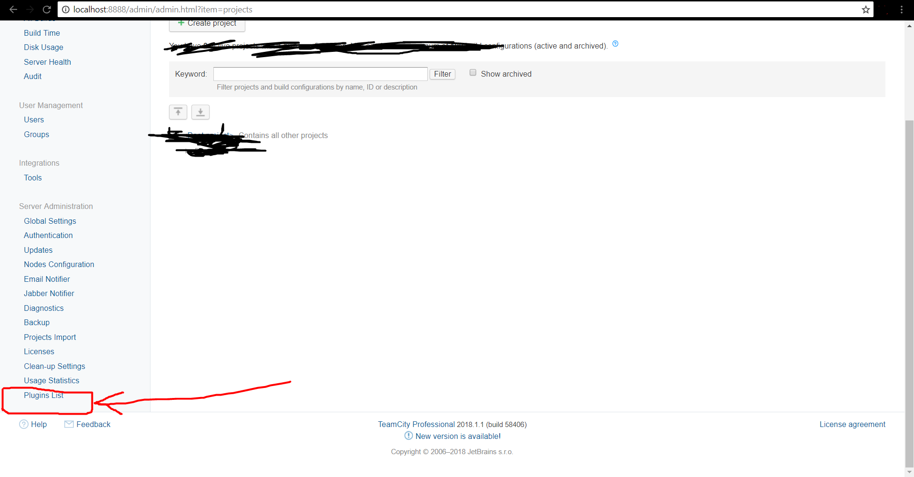
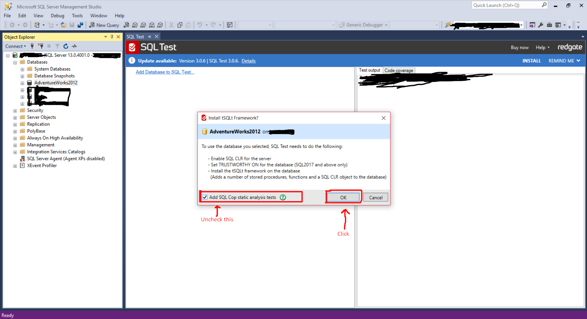
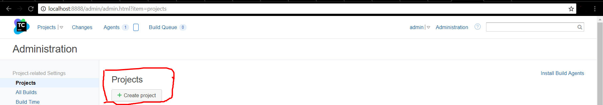

# svt-continuous-integration
> Configure SQL Test, Visual Studio NUnit Tests, TFS, and TeamCity (Continuous Integration)   

## Getting Started
> This readme will guide you through installation and configuration of **SQL Test**, **TeamCity**, **TFS**, and **Visual Studio NUnit** from scratch.   

### Prerequisites
>* Visual Studio installed   
>* SQL server installed    
>* Have a hotmail/live/outlook email id    
>* Sign in to visual studio with account    

## Download Setups 

>*  Download [TeamCity](https://www.jetbrains.com/teamcity/download/)    
>*  Download zip [tSQLt Runner](https://github.com/cprieto/tsqlt-teamcity/releases) 


    
   
   
>*  Download [SQL Test](https://www.red-gate.com/dynamic/products/sql-development/sql-test/download) 

## Installing 

#### TeamCity 

  > Run downloaded setup of teamcity and proceed with standard installation. It will prompt for a port in during installation.  
  Enter port i.e. 8888 and note that down. After a few steps of installtion, it will show an **information   
  window** like this 
  
  
   
  
  
  > Next step is to select system account for given steps like this 
  
  
   
  
  
  > Once you are done with installtion, it will automatically start teamcity in your default browser. 
  Follow below given steps if it doesn't start.
  1. Open **cmd** as admin.
  2. Enter
  ```
  cd C:\TeamCity\bin
  ```
  3. execute command
  ```
  teamcity-server start
  ```
  4. Open **localhost:yourport** in browser. 
  you will have to go through a few steps more in browser if it is the first time that you have installed teamcity on your machine. 
  follow those steps i.e. create account (enter username, password). One of those steps will be about **Database**. Have a look 
  at given image and select that option and go on with further steps if any.
  
  > Image Source: https://confluence.jetbrains.com/display/TCD10/Installation+Quick+Start 
  
  
   
  
  
  > Setup is done. 
  
#### tSQLt Runner 
   
   > Open teamcity in browser, go to **Administration** tab on top 


    
   

   > Scroll down and click **Plugins List** 


    
   

   > follow below shown steps 


    
   

   > select zip and click upload 


    
   
    
   > Now you should see **tsqlt runner** in external plugins 
   
   
   
    
   
   
#### SQL Test

   > Run downloaded sql test setup and select only **SQL Test** 
   
   
    
   
   
   > and go on with standard installation
   
   ##### Verify sql test installation
   
  >  1. Open **Microsoft SQL Server Management Studio (MSSMS)** and connect with your username and password. 
  >  2. Go to **Databases** and right click on any schema/database.
  >  3. You should see following options
   
   
    
   
   
   ##### Running sql test in Microsoft SQL Server Management Studio (MSSMS) 
   
   > Open MSSMS 
   > Go to **Databases** 
   > Right click on any schema/database 
   > Click **New Test** and after that you should see below given option if it is the first time. 
   
   
    
   
   
   > Write test case name(test stored procedure) 
   * It should start with **test** word (standard notation) 
   
   
    
   
   
   > After above steps, you should see an auto generated new sample test case like this 
   
   
    
   
   
   > Inorder to keep this tutorial simple, remove comments and make a small change in above shown test case 
   > i.e. it should look like this 
   
   
    
   
   
   > Execute this test case (procedure script)
   
   
    
   
   
   > You should see below given message 
   
   
   
   
   > After that, go to below shown tab 
   
   
    
   
   > Run test case in MSSMS to verify if framework works or not  
   
   
    
   
   > Success message 
   
   
    
   
   
   
## Configure and run 
   
   #### Create TFS project live (Tested using hotmail account) 
   
   > Go to TFS Online: https://visualstudio.microsoft.com/vso/  
   > Get started for free   
   > Sign in (Sign up and sign in if you do not have microsoft account i.e. hotmail/live/outlook)   
   > Create project as shown below   
   
   
    
   
   
  >  then 
   
   
    
   
   
 >   And you should see your first TFS project created
   
   
   
   
   
 >   Now we need to generate token. To do that, go to security tab as shown below
   
   
    
   
   
 >   Click **add** as shown below
   
   
    
   
   
 >   fill the given fields 
   
   
    
   
   
 >   scroll down and click **Create Token** 
   
   
    
   
   
 >   you should now copy the generated token and note it down as shown below 
   
   
    
   
   
>    you have successfully configured tfs online. Now it is time to create a visual studio project with NUnit tests.
   
#### Create visual studio project 
   
 >   Go to File => New => Project and select the project as shown below.
 >   Name the project same as you named the tfs repository (in order to keep it simple for now) 
   
   
    
   
   
  >  now you have empty test method as shown below but it is in MSTest framework. (We will change it to NUnit as we move further) 
   
   
    
   
   
 >   Add a new project to same solution (that needs to be nested) 
   
   
    
   
   
 >   select project type as shown below 
   
   
    
   
   
 >   now you have empty class 
   
   
    
   
   
 >   change above shown class to **calculator** class (for testing purpose) 
   
   
   
   
   
 >   Adding reference of calculator project (ClassLibrary1) to testing project 
   
   
    
   
   
 >   select as shown below 
   
   
    
   
   
 >   Adding **NUnit** test framework and **NUnit adapter** to the test project 
   
   
    
   
   
    
   
   
    
   
   
   
   
   
   
 >   Change **UnitTest1** class (or whatever you named it) as shown below 
   
   
    
   
   
 >   Build solution  
 >   Run test cases as shown below 
   
   
    
   
   
 >   Go to **Test Explorer** to see results 
   
   
    
   
   
 >   Test cases result 
   
   
    
   
   
 >   you can also run tests using **Test Explorer** 
   
   
     
   
   
   
 #### connect remote repository (online tfs) to visual studio project 
  
 >  Open team explorer 
  
  
    
  
  
 >  Click connect 
  
  
    
  
  
   
  
   
>    select the project 

   
    
   

   
>    map and get project 
   
   
    
   
 >   mapped successfully. now we need to push the project (add to source control) 
   
   
     
   
   
     
   
   
     
   
   
 >   go to team explorer => pending changes => check in changes 
   
   
     
   
   
     
   
   
    
   
   
     
   

 >   tfs is configured. follow next step of creating project in teamcity 
   
  #### Creating project in teamcity 
  
 >  Open team city in browser and click **Administration** tab on top 
 >  before we move on to creating project, let's add some tools. 
  
  
   
  
  
   
  
  
 >  add NUnit console 
 
  
   
  
  
>   select NUnit console version 
  
  
   
  
   
 >  again click install tool and add NuGet installer (version 4.8.1 for this tutorial)
  
  
   
  
   
   
 >  Go to Administration tab and then create new project 
   
   
    
  
  
 >  after that, select visual studio team service 
  
  
    
  
  
   
  
 >  choose repository 
  
  
   
  
  
 >  and after that you will be prompted with an option, just click **Proceed**. 
  
  
   
  
  
 >  after this, just click cancel and go to **Parameters** tab.  
 >  we need to add 4 parameters.
  
  
   
  
  
  
   
  
  
  1. 
 >  add project name parameter 
  
  
   
  
  
  2. 
 >  click **add parameter** as shown in one of above pics.   
 >  this time, add database server parameter. you can find your database server name by clicking  
  Microsoft sql server management studio 
  
  
   
  
  
  
   
  
  
  3.
 >  click add parameter and add database name.  
 >  you can get your database name from microsoft sql server management studio as shown below  
  
  
   
  
  
   
  
  
  4. 
  > click add parameter and add database username 
  
  
   
  
  
>   parameters added. you should see these 4 parameters 
  
  
   
  
  
  > Now we need to add 4 build steps.
  > Go to build steps tab 
  
  
   
  
  
  
   
  
  
 >  select NuGet installer 
  
  
   
  
  
  1. 
 >  add NuGet installer to your project and save 
  
  
   
  
  
  2. 
  > click add build step and select MS Build   
  > add MS Build step 
  
  
   
  
  
 >  save. 
  
  3.
 >  click add build step and select NUnit 
 >  add NUnit step 
  
  
   
  
  
>   save 
  
  4. 
 >  click add build step and select tSQLt Runner  
 >  add tSQLt Runner step (to run sql tests) 
  
  
   
  
  
  
 >  you should see these 4 build steps 
  
  
   
  
  
  
  > In order to avoid any errors, go to visual studio project and make some kind of changes to project like 
  > go to calculator class 
  > go to add method 
  > change return statement from 
  ```
  return a+b; 
  ```
 >  to 
  ``` 
  return a+b+3;
  ```
 >  save it (Ctrl+S) and again change it to 
  ```
  return a+b;
  ```
>   save it (Ctrl+S). Go to team explorer => pending changes => check in 
  
  
   
  
  
>   THE TIME HAS COME ! 

>  A few steps more to run teamcity continuous integration 

>   Redirect to: **localhost:yourport** in your browser and click your project 
  
   
  
>   click run and wait for the result 
  
   
  
>   result 
  
   
  
>   You have your continuous integration. Enjoy!. 
  
  
## Common Errors

* NuGet missing on computer 

 


* Solutions 

Case 1. 

Add NuGet installer in your teamcity build step on top (1st step). 

Case 2. 
> Go to your visual studio project.

> Change a few lines. 

> Save it. 

> Again undo changes. 

> Save it. 

> Go to team explorer => pending changes => check in. 


  
  
  
  
  
